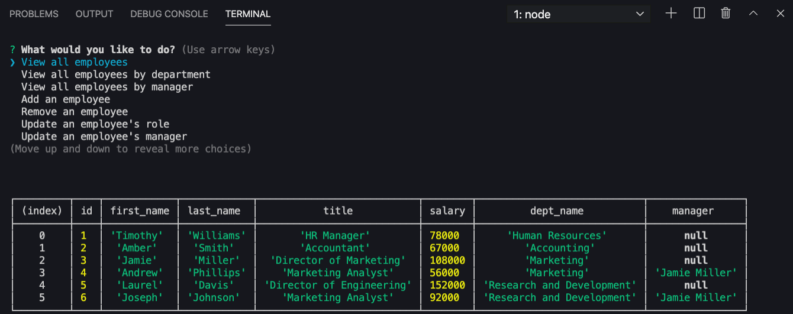

# employee-tracker

  ## The Repository
  Link to repository: https://github.com/awebb8/employee-tracker
  Link to video: https://drive.google.com/file/d/1BAQsTLwNb3Aa4XMm2IsGpZBucQQsZ1zv/view

  ## About
  The Employee Tracker is a Content Management System that manages a company's employees using node, inquirer, and MySQL. This command-line application allows a user to add new employees, remove an employee, update an employee's role, and update an employee's manager. Additionally, users can view all employees or view employees by department or manager.

  

  ## Table of Contents
  * [Installation](#installation)
  * [Usage](#usage)

  ## Installation
  Clone the repository using the link above to the GitHub repository.  Once cloned, utilize "npm install" to install Express, Express-Handlebars, MySQL. MySQL is used to connect to the MySQL database and perform queries, Inquirer is used to interact with the user via the command-line, and Console.table is used to print MySQL rows to the console. For more information on installing and using Inquirer, visit https://www.npmjs.com/package/inquirer/v/0.2.3. For more information on installing and using MySQL, visit https://www.npmjs.com/package/mysql. For more information on installing and using console.table, visit https://www.npmjs.com/package/console.table.
  Utilize the schema.sql and seed.sql files to create the database and tables in MySQL.

  ## Usage
  Begin viewing and managing the departments, roles, and employees in the company by entering "node index.js" into the console.  Select what you want to do from viewing all employees to updating an employee.  Once you make your selection, you will be prompted with either the table of data requested or questions to fulfill your request. 